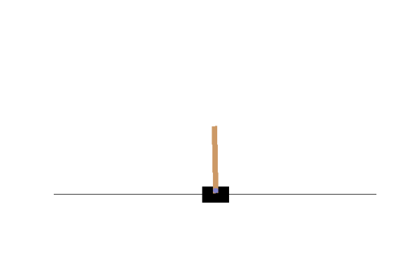
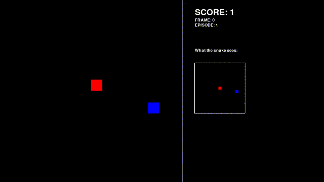
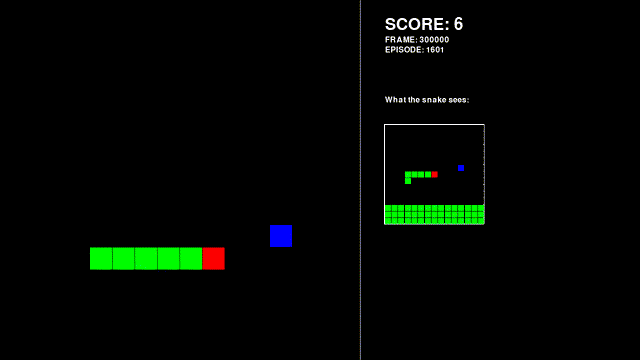

## Comparing Algorithms

Each of these algorithms, reinforcement learning and has its pros and cons, but what do they look like in action?

Here is my implementation reinforcement learning playing a simple [cartpole](https://gym.openai.com/envs/CartPole-v1/) game:



At first, it is complete and utter garbage at the game. It keeps falling over without any "strategy". After just 30 seconds, the agent learns some strategies, such as countering the falling pole by moving in that direction.

<details>
  <summary>Main Snake Reinforcement Learning Code (Click to expand)</summary>
  
  ```py
import os
import random
import gym
import numpy as np
from collections import deque
from tensorflow.keras.models import Model, load_model
from tensorflow.keras.layers import Input, Dense
from tensorflow.keras.optimizers import Adam, RMSprop
from matplotlib import animation
import matplotlib.pyplot as plt
 
def save_frames_as_gif(frames, path='./', filename='rl.gif'):
    plt.figure(figsize=(frames[0].shape[1] / 72.0, frames[0].shape[0] / 72.0), dpi=72)
    patch = plt.imshow(frames[0])
    plt.axis('off')
    def animate(i):
        patch.set_data(frames[i])
    anim = animation.FuncAnimation(plt.gcf(), animate, frames = len(frames), interval=50)
    anim.save(path + filename, writer='ffmpeg', fps=60)

def OurModel(input_shape, action_space):
    X_input = Input(input_shape)
    X = Dense(512, input_shape=input_shape, activation="relu", kernel_initializer='he_uniform')(X_input)
    X = Dense(256, activation="relu", kernel_initializer='he_uniform')(X)
    X = Dense(64, activation="relu", kernel_initializer='he_uniform')(X)
    X = Dense(action_space, activation="linear", kernel_initializer='he_uniform')(X)
    model = Model(inputs = X_input, outputs = X)
    model.compile(loss="mse", optimizer=RMSprop(lr=0.00025, rho=0.95, epsilon=0.01))
    model.summary()
    return model
 
frames = []

class DQNAgent:
    def __init__(self):
        self.env = gym.make('CartPole-v1')
        # by default, CartPole-v1 has max episode steps = 500
        self.state_size = self.env.observation_space.shape[0]
        self.action_size = self.env.action_space.n
        self.EPISODES = 30
        self.memory = deque(maxlen=2000)
 
        self.gamma = 0.95    # discount rate
        self.epsilon = 1.0  # exploration rate
        self.epsilon_min = 0.001
        self.epsilon_decay = 0.999
        self.batch_size = 64
        self.train_start = self.batch_size
 
        # create main model
        self.model = OurModel(input_shape=(self.state_size,), action_space = self.action_size)
 
    def remember(self, state, action, reward, next_state, done):
        self.memory.append((state, action, reward, next_state, done))
        if len(self.memory) > self.train_start:
            if self.epsilon > self.epsilon_min:
                self.epsilon *= self.epsilon_decay
         
    def act(self, state):
        if np.random.random() <= self.epsilon:
            return random.randrange(self.action_size)
        else:
            return np.argmax(self.model.predict(state))
 
    def replay(self):
        if len(self.memory) < self.train_start:
            return
        minibatch = random.sample(self.memory, min(len(self.memory), self.batch_size))
        state = np.zeros((self.batch_size, self.state_size))
        next_state = np.zeros((self.batch_size, self.state_size))
        action, reward, done = [], [], []
        for i in range(self.batch_size):
            state[i] = minibatch[i][0]
            action.append(minibatch[i][1])
            reward.append(minibatch[i][2])
            next_state[i] = minibatch[i][3]
            done.append(minibatch[i][4])
        target = self.model.predict(state)
        target_next = self.model.predict(next_state)
        for i in range(self.batch_size):
            if done[i]:
                target[i][action[i]] = reward[i]
            else:
                target[i][action[i]] = reward[i] + self.gamma * (np.amax(target_next[i]))
        self.model.fit(state, target ,batch_size=self.batch_size, verbose=0)
 
    def run(self):
        for e in range(self.EPISODES):
            state = self.env.reset()
            state = np.reshape(state, [1, self.state_size])
            done = False
            i = 0
            while not done:
                frames.append(self.env.render(mode="rgb_array"))
                action = self.act(state)
                next_state, reward, done, _ = self.env.step(action)
                next_state = np.reshape(next_state, [1, self.state_size])
                if not done or i == self.env._max_episode_steps-1:
                    reward = reward
                else:
                    reward = -100
                self.remember(state, action, reward, next_state, done)
                state = next_state
                i += 1
                if done:                   
                    print("episode: {}/{}, score: {}, e: {:.2}".format(e, self.EPISODES, i, self.epsilon))
                self.replay()
 
if __name__ == "__main__":
    agent = DQNAgent()
    agent.run()
    save_frames_as_gif(frames)
```
    
</details>

Cartpole is a rather simple game, so it can quickly become rather good at the game. However, a more complicated game, like snake, can take much longer, for days, or even weeks, to become proficient at it. Here is a reinforcement algorithm to play snake I implemented with tensorflow and pygame.




<details>
  <summary>Reinforcement Learning Snake Code (Click to expand)</summary>
  
  ```py
import pygame
from pygame import K_LEFT, K_RIGHT, K_UP, K_DOWN
import random
import tensorflow as tf
from tensorflow.keras import layers, models
import numpy as np
import os

bw = 16

base_path = os.getcwd() + "/"

vision = 7

batch_size = 32

class AI:
    def __init__(self):
        self.model = models.Sequential()
        #self.model.add(layers.Flatten(input_shape=((vision * 2 + 1) ** 2 + 2)))
        self.model.add(layers.Dense(64, activation="relu", input_shape=((vision * 2 + 1) ** 2 * 3,)))
        self.model.add(layers.Dense(32, activation="relu"))
        self.model.add(layers.Dense(4))
        self.model.summary()
        self.model.compile(optimizer=tf.keras.optimizers.Adam(), loss="MSE")
    def train(self, x, y):
        x = np.array(x)
        np.reshape(x, (-1, (vision * 2 + 1) ** 2 * 3))
        y = np.array(y)
        p = self.model.fit(x, y, epochs=1, batch_size=batch_size, verbose=0, shuffle=True)
        print("LOSS!!!!!!!!!!!!!!!!!!!: " + str(round(p.history['loss'][0], 5)))
    def predict(self, x):
        return self.model.predict(np.array([x]))

fwidth = 1280
fheight = 720
width = 720
height = 720

currPress = K_RIGHT

class Snake:
    def __init__(self):
        self.reset()
    def reset(self):
        self.snakeHead = [bw // 2, bw // 2]
        self.sbody = []
        self.len = 1
        self.dir = currPress
        self.gameOver = False
        for i in range(self.len):
            self.sbody.append([self.snakeHead[0] - (self.len - i - 1), self.snakeHead[1]])
        self.setFood()
    def setFood(self):
        cont = True
        while cont:
            cont = False
            self.food = [random.randint(0, bw-1), random.randint(0, bw-1)]
            for i in range(self.len):
                if self.food[0] == self.sbody[i][0] and self.food[1] == self.sbody[i][1]:
                    cont = True
                    break
    def drawRect(self, screen, x, y, color):
        pygame.draw.rect(screen, color, (x * width // bw, y * height // bw, width // bw-1, height // bw-1), 0)
    def render(self, screen):
        if self.gameOver:
            global currPress
            currPress = K_RIGHT
            self.reset()
        color = (255, 0, 0)
        self.drawRect(screen, self.snakeHead[0], self.snakeHead[1], color)
        color = (0, 255, 0);
        for i in range(0, self.len-1):
            self.drawRect(screen, self.sbody[i][0], self.sbody[i][1], color)
        color = (0, 0, 255)
        self.drawRect(screen, self.food[0], self.food[1], color)
    def move(self):
        ate = False
        if ((currPress != K_DOWN or self.dir != K_UP) and
            (currPress != K_UP or self.dir != K_DOWN) and
            (currPress != K_RIGHT or self.dir != K_LEFT) and
            (currPress != K_LEFT or self.dir != K_RIGHT)):
            self.dir = currPress
        if self.dir == K_RIGHT:
            self.snakeHead[0] += 1
            self.sbody.append(self.snakeHead.copy())
            self.len += 1
        if self.dir == K_LEFT:
            self.snakeHead[0] -= 1
            self.sbody.append(self.snakeHead.copy())
            self.len += 1
        if self.dir == K_DOWN:
            self.snakeHead[1] += 1
            self.sbody.append(self.snakeHead.copy())
            self.len += 1
        if self.dir == K_UP:
            self.snakeHead[1] -= 1
            self.sbody.append(self.snakeHead.copy())
            self.len += 1
        if self.snakeHead[0] == self.food[0] and self.snakeHead[1] == self.food[1]:
            self.setFood()
            ate = True
        else:
            self.sbody.pop(0)
            self.len -= 1
        for i in range(self.len-1):
            if self.snakeHead[0] == self.sbody[i][0] and self.snakeHead[1] == self.sbody[i][1]:
                self.gameOver = True
                break
        if self.snakeHead[0] < 0 or self.snakeHead[1] < 0 or self.snakeHead[0] > bw-1 or self.snakeHead[1] > bw-1:
            self.gameOver = True
            
        if ate:
            return 1
        elif self.gameOver:
            return -1
        else:
            return 1 / (10 + abs(self.food[0] - self.snakeHead[0]) + abs(self.food[1] - self.snakeHead[1]))
    def getBoard(self):
        board = []
        bxmin = self.snakeHead[0] - vision
        bxmax = self.snakeHead[0] + vision
        bymin = self.snakeHead[1] - vision
        bymax = self.snakeHead[1] + vision
        for i in range(bxmin, bxmax + 1):
            tmpb = []
            for j in range(bymin, bymax + 1):
                tmptmpb = [0, 0, 0]
                if self.snakeHead[0] == i and self.snakeHead[1] == j:
                    tmptmpb[0] = 1
                for k in range(self.len - 1):
                    if self.sbody[k][0] == i and self.sbody[k][1] == j:
                        tmptmpb[1] = 1
                if i < 0 or i >= bw or j < 0 or j >= bw:
                    tmptmpb[1] = 1
                if self.food[0] == i and self.food[1] == j:
                    tmptmpb[2] = 1
                for k in range(3):
                    board.append(tmptmpb[k])
        return board
        

pygame.init()

font_24 = pygame.font.SysFont(None, 24)
font_48 = pygame.font.SysFont(None, 48)

screen = pygame.display.set_mode([fwidth, fheight])
pygame.display.set_caption("Snake DQN")

clock = pygame.time.Clock()

stop = False

s = Snake()

ai = AI()
try:
    ai.model = models.load_model(base_path + "snakeDQN.hdf5")
    print("LOADED MODEL")
except:
    ai.__init__()
    print("CREATED NEW MODEL")

target_ai = AI()
target_ai.model.set_weights(ai.model.get_weights())

gamma = 0.95
tau = 256
epsilon = 0.2
terminal_state = -1

saveInc = 16

udata = []
frames = 0
episode = 1

recording = False
rframes = 0

try:
    os.mkdir(base_path + "images")
except OSError as error:
    print(error)   

while not stop:
    for event in pygame.event.get():
        if event.type == pygame.QUIT:
            stop = True
        if event.type == pygame.KEYDOWN:
            if event.key in [K_RIGHT, K_LEFT, K_UP, K_DOWN]:
                currPress = event.key

    # TRAINING STUFF
    
    epsilon -= 0.000003
    epsilon = max(epsilon, 0.02)
    print("Frame: " + str(frames))
    print("epsilon: " + str(round(epsilon, 7)))

    if frames % tau == 0:
        print("COPY")
        target_ai.model.set_weights(ai.model.get_weights())
    
    pobs = s.getBoard()

    action = random.randint(0, 3)
    if random.random() > epsilon:
        rawaction = ai.predict(pobs)[0]
        print(rawaction)
        action = np.argmax(rawaction)

    if action == 0:
        currPress = K_RIGHT
    elif action == 1:
        currPress = K_LEFT
    elif action == 2:
        currPress = K_UP
    elif action == 3:
        currPress = K_DOWN
    
    reward = s.move()
    observation = s.getBoard()

    print(reward)
    if reward == terminal_state:
        episode += 1
    
    tdata = list(udata)
    tdata.append(np.array([np.copy(pobs), np.copy(observation), action, reward]))
    udata = np.array(tdata)
    if len(udata) > 2048:
        np.delete(udata, 0, 0)

    data = np.copy(udata)
    np.random.shuffle(data)
    if frames % 1 == 0:
        tx = np.array([])
        ty = np.array([])
        ttx = list(tx)
        tty = list(ty)
        for i in range(min(len(data), batch_size)):
            ttx.append(np.copy(data[i][0]))
            actual = ai.predict(data[i][0])[0]
            if data[i][3] == terminal_state:
                actual[data[i][2]] = data[i][3]
            else:
                future = target_ai.predict(data[i][1])[0]
                #print(np.argmax(future))
                actual[data[i][2]] = data[i][3] + gamma * future[np.argmax(future)]
            tty.append(np.copy(actual))
        tx = np.array(ttx)
        ty = np.array(tty)
        print("@")
        ai.train(tx, ty)

    print("\n")

    if frames % saveInc == 0:
        ai.model.save(base_path + "snakeDQN.hdf5")
        print("SAVED")

    # RENDER STUFF
    
    screen.fill((0, 0, 0))
    s.render(screen)
    pygame.draw.line(screen, (255, 255, 255), (width, 0), (width, height))
    
    text1 = font_48.render("SCORE: " + str(s.len), True, (255, 255, 255))
    text1_rect = text1.get_rect(center = (0, 50))
    text1_rect.left = width + 50
    screen.blit(text1, text1_rect)

    text2 = font_24.render("FRAME: " + str(frames), True, (255, 255, 255))
    text2_rect = text2.get_rect(center = (0, 80))
    text2_rect.left = width + 50
    screen.blit(text2, text2_rect)

    text3 = font_24.render("EPISODE: " + str(episode), True, (255, 255, 255))
    text3_rect = text3.get_rect(center = (0, 100))
    text3_rect.left = width + 50
    screen.blit(text3, text3_rect)

    text4 = font_24.render("What the snake sees:", True, (255, 255, 255))
    text4_rect = text4.get_rect(center = (0, 200))
    text4_rect.left = width + 50
    screen.blit(text4, text4_rect)

    visionx = width + 50
    visiony = 250
    visionw = 200
    visionh = 200
    pygame.draw.rect(screen, (255, 255, 255), (visionx-2, visiony-2, visionw, visionh), 2)
    for i in range((vision * 2 + 1) * (vision * 2 + 1)):
        bidx = i * 3
        pygame.draw.rect(screen, (pobs[bidx] * 255, pobs[bidx + 1] * 255, pobs[bidx + 2] * 255),
                         (visionx + i // (vision * 2 + 1) * visionw // (vision * 2 + 1),
                          visiony + i % (vision * 2 + 1) * visionh // (vision * 2 + 1),
                          visionw // (vision * 2 + 1)-1,
                          visionh // (vision * 2 + 1)-1), 0)

    if frames % 10000 == 0:
        recording = True
        try:
            os.mkdir(base_path + "images/" + str(frames))
        except OSError as error:
            print(error)   

        rframes = 0

    if recording:
        pygame.image.save(screen, "images/" + str(frames - rframes) + "/snakeDQN" + str(frames) + ".png")
        rframes += 1
        if rframes >= 1000:
            recording = False
    
    clock.tick(100)
    pygame.display.flip()
    frames += 1

pygame.quit()
```
    
</details>
